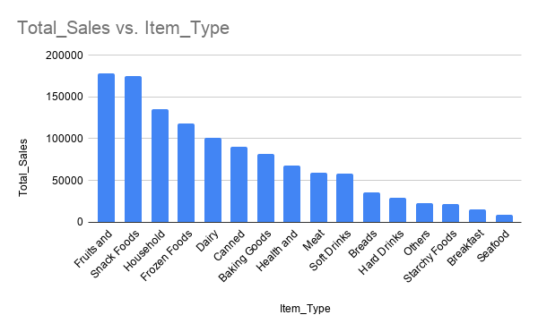
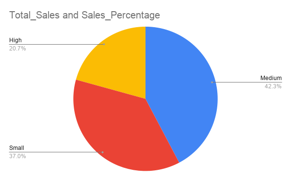
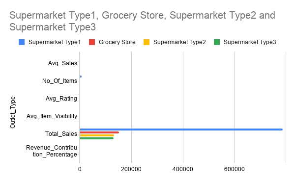

# Blinkit Sales Analysis using SQL

This project analyzes retail sales data inspired by Blinkit using MySQL.

The goal of the analysis was to explore product performance, outlet contribution, and customer behavior patterns using SQL queries.

---

## Dataset Overview

The dataset contains **8,500+ records** including:

- Product categories
- Outlet types and sizes
- Product visibility
- Product ratings
- Total sales

---

## Business Questions

This analysis answers questions such as:

- Which product categories generate the highest revenue?
- Which outlet types contribute the most to total sales?
- Does product rating influence revenue?
- How does product visibility impact product performance?

---

## Key Insights & Business Recommendations

1. Supermarket Type1 dominates revenue — but that's a concentration risk
Supermarket Type1 accounts for ~65% of total revenue. While this reflects strong footprint and customer trust, over-reliance on a single outlet type is a strategic vulnerability. Recommendation: Blinkit should identify the top 20% of Grocery Store outlets by sales-per-item and run targeted assortment expansion pilots there — diversifying revenue without heavy capex.

2. Medium outlets punch above their weight
Medium-sized outlets generate ~42% of total sales despite likely representing a smaller share of total outlet count. This suggests medium outlets have an optimal balance of SKU variety and operational efficiency. Recommendation: New outlet expansion should prioritize medium-format stores over large ones until diminishing returns are observed in the data.

3. Low Fat products outperform Regular — this is a demand signal, not a coincidence
Low Fat products consistently outsell Regular across categories. This aligns with broader consumer health trends and suggests this isn't random variance. Recommendation: Procurement and private-label teams should shift shelf allocation toward Low Fat variants, especially in Snack Foods and Dairy where the gap is likely largest.

4. Visibility is not the bottleneck you think it is
High product visibility does not reliably translate to higher sales. Low-visibility products still generate significant revenue, suggesting that placement alone doesn't drive conversions — product type and price point matter more. Recommendation: Stop investing in visibility optimization for commodity categories. Instead, redirect that effort toward improving availability (reducing stockouts) for top-performing item types.

5. Outlet age is not a reliable predictor of performance
Outlets established in different years show no consistent upward or downward trend in revenue per outlet. Newer outlets are not automatically underperforming, and older ones aren't guaranteed cash cows. Recommendation: Performance reviews should be driven by sales-per-item and outlet type — not outlet age — when making restocking or closure decisions.

6. Ratings have a weak relationship with revenue — investigate why
Medium-rated products contribute a disproportionate share of total sales, suggesting that customers are buying based on habit, price, or availability rather than quality signals. Recommendation: Blinkit's product and UX teams should A/B test whether surfacing ratings more prominently at the point of discovery changes purchase behavior — this could unlock either higher-quality product adoption or expose that ratings data needs improvement.

---

## SQL Concepts Used

- Aggregations (SUM, AVG, COUNT)
- CASE statements
- Window functions (RANK, PARTITION BY)
- Subqueries
- Data cleaning

---

## Tools Used

- SQL (MySQL)
- Data Analysis
- Excel (Charts)

## Sales by Item Type

## Outlet Size Contribution

## Outlet Type Revenue Contribution

## 🔗 Related Links

- 📖 Blog Post: [What I Learned from Analyzing Retail Data Using SQL](https://open.substack.com/pub/poojasinghwork20/p/what-i-learned-from-analyzing-8500?r=382nn7&utm_campaign=post&utm_medium=web)
- 💼 LinkedIn: [Pooja Singh](http://linkedin.com/in/poojasingh2010)
